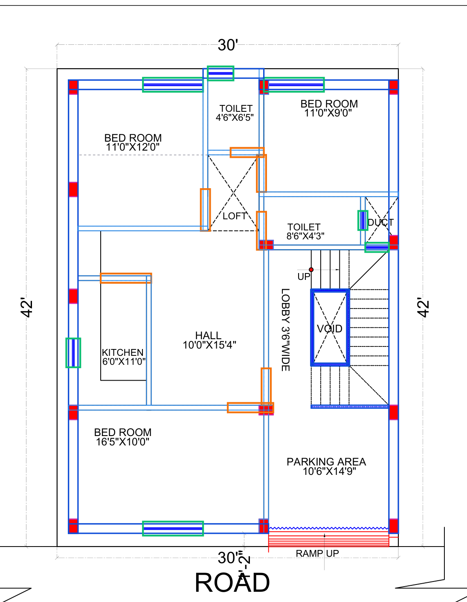
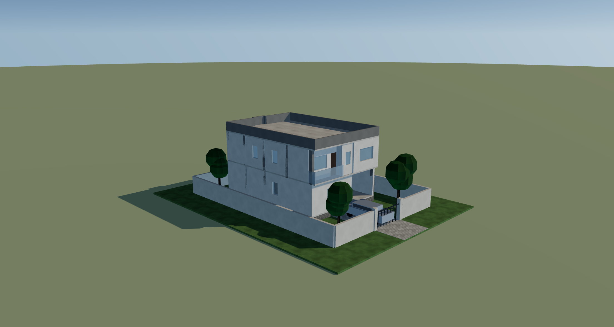
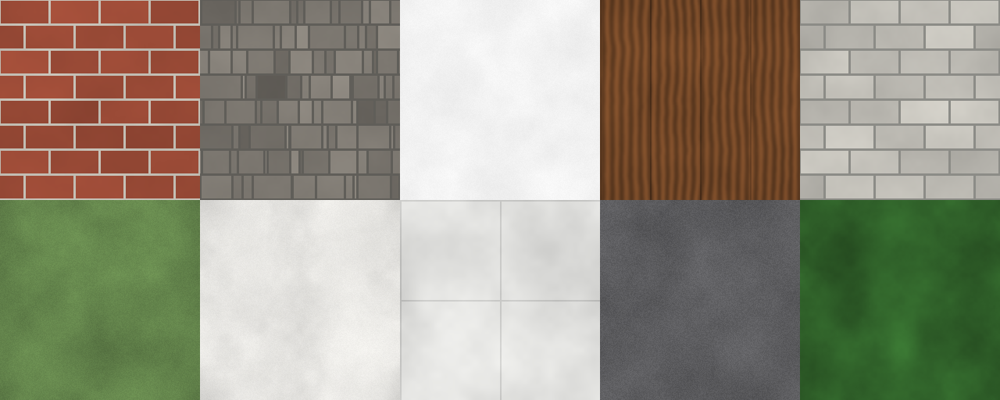

# floor → rendered

Drop a set of floor-plan PDFs into a web page and get a **3D building model** you
can open in Blender or Twinmotion.

```
plan PDFs ──▶ vector geometry ──▶ walls · openings · columns · rooms ──┐
                                                                       │
heights you set ───────────────────────────────────────────────────────┼──▶ 3D model ──▶ .glb / .obj
materials you pick ────────────────────────────────────────────────────┤
site you stage ────────────────────────────────────────────────────────┘
```

## The one rule

**A floor plan contains no vertical information.** It is a horizontal cut: it
says where things are and how thick, and nothing about how tall. So no height is
ever inferred from a plan.

A drawing *set*, though, may say plenty — on the sheets that are not plans. An
elevation or a section states its levels outright (`FIRST FLOOR LEVEL +3.60`),
and the difference between two of them is a storey height, measured the same way
the plan's scale is. A beam schedule states a beam depth; a foundation note
states an excavation.

So every height in the output is one of four things, and says which where you
read it: **measured** off a sheet that states it, **derived** from a schedule or
a note, **yours** because you typed it, or **assumed** because nothing in the set
said otherwise. Anything you type is never overwritten by a later reading, and
when two sheets disagree the tool reports both rather than averaging them.

What the drawings *do* decide is the plan, and that is read exactly: every wall
in the model is two parallel lines that a CAD package actually plotted. Nothing
is generated, inferred by a model, or filled in to cover a gap. Where the
extractor can't tell, it says so and lets you fix it.

---

## Quick start

```bash
make install
make test        # 142 tests, about 40 seconds
make dev         # http://127.0.0.1:8020
```

Then drag the whole drawing set — floor plans, layout, footings, the lot — onto
the page.

> The example drawings this was built against are a real client's project and are
> **not published with the code**. Drop your own vector CAD set into `example/`
> (or anywhere) and everything works; the 49 tests that need a drawing set skip
> cleanly without one, and the other 93 still run.

Command line, same pipeline:

```bash
.venv/bin/python -m app.cli example --out build
```

Everything runs locally. No API keys, no network calls, no third-party service.

---

## What it looks like

**Check the read** — the extraction drawn back over the sheet it came from.
Blue is walls (dark = external), orange doorways, green glazing, purple railings,
magenta the RCC columns, dashed grey the rooms it managed to measure.



**The model** — two storeys on a 2 ft plinth with a 3 ft parapet, in the
browser, loaded from the very `.glb` the download button hands you.



---

## How the drawing is read

CAD-plotted PDFs carry the drawing as vector paths, so this is measurement, not
image recognition. The extractor leans on four conventions, each of which can be
checked by eye in the drawing itself:

| Convention | What it gives |
|---|---|
| A wall is two parallel face lines a wall-thickness apart | wall centreline, extent and thickness |
| **Both faces are drawn with the same pen** | keeps a dimension line running 1 ft off a facade from pairing with it and inventing a 12″ wall |
| A doorway leaves one face drawn across the gap, jamb-capped, **closed at its far end and inside the building** | door position and width |
| Glazing is drawn in a different colour inside the wall band | window position and width |
| The same colour with **no wall band behind it** | a railing — a balcony edge or a stairwell guard, built waist high rather than as a wall |
| RCC columns are solid red rectangles | column grid, the shared datum every storey is pinned to — and, where both walls stop at a corner column, the corner itself |
| A ladder of parallel lines at a constant pitch, beside an `UP` or `DN` marker | a stair — the pitch is the going, the line length is the flight width |
| Where a wall tees into another, only its exposed face is drawn past the junction | walls are run on into the wall they meet — and no further, so a doorway is never bridged |

Five more rules keep rubbish out: a band that is one rung of an evenly spaced
ladder is stair treads or hatching, not a wall — those rungs are handed to the
stair reader rather than discarded, which is how the staircase gets built; a band shorter than it is thick
is a corner artefact, not a wall; wall fragments far from the building are
dropped; a gap only counts as a doorway if it is at least 2 ft wide, closed
at its far end by a wall or a jamb, inside the building, and not opening onto a
named duct or shaft; and a gap in a wall that is **not** a doorway, narrower
than one and with a face still drawn across it, is filled in solid — the wall is
there, the drafter just let one face lapse.

Each of those earns its keep on the example set: without them a site boundary
drawn along the same line as the front wall becomes a doorway at the road end,
the stretches of external wall where the inner face was not carried between
columns become a way into the house beside the toilet, and the one under the
first floor's balcony becomes a hole in the back corner.

### The scale is measured, not assumed

Nothing in a PDF says how big the building is. Rather than trust a title-block
scale note, the extractor **measures rooms against their own printed dimension
labels**: flood-fill the room `BED ROOM 11'0"X12'0"` sits in, compare the fill to
the label, and you have points-per-foot. Each room gives two readings, one per
axis. They only agree if the label, the walls and the orientation are all right,
so disagreement is a rejection signal rather than something to average away.

On the example set that gives **10.1 points per foot** from five rooms
agreeing to 1%, and it is cross-checked twice over:

* every wall thickness on the sheet then comes out as **5.1″ and 10.1″** —
  round inches, which no wrong scale produces;
* the ground floor measures **29′ × 39′-10″**, which is what the layout sheet
  dimensions the column grid as — a number the extractor never looked at.

If a set has no usable room labels, the page says the scale is a guess and asks
you to click two points on a known dimension instead.

---

## The steps

1. **Drawings** — drop the PDFs in.
2. **Sheets** — each sheet is classified from its title block (ground floor,
   first floor, layout, footing, tie beam, services, structural detail, or a
   designer's render). Only floor plans become storeys, and only if you agree.
   Override anything.
3. **Check the read** — the overlay above. Click an opening to change its type,
   width, sill or head; click a bare stretch of wall to add one (shift-click for
   a window); calibrate the scale by hand; or re-read the sheet from scratch.
4. **Heights** — floor-to-floor, sills, lintels, slab, plinth, parapet, roof.
   All yours.
5. **Materials & site** — a finish for each surface, and the compound around it.
   Also all yours; see below.
6. **3D model** — orbit it, then download it.

---

## Materials

Four starting points — *Plaster & stone*, *Exposed brick*, *Modern white*,
*Sandstone* — then a colour and a finish per surface: external and internal
walls, plinth band, parapet and bands, roof, slabs, exposed columns, doors,
glazing, railings, ground, driveway and boundary wall.

The textures are **generated, not shipped**: brick, coursed stone, plaster,
concrete, screed, timber, paving, asphalt, grass, foliage and bark are drawn
from numpy at build time and encoded to PNG. They tile seamlessly — a test
checks each one's opposite edges actually match — and they are sized in metres,
so a brick is brick-sized on a 3 m wall and on a 12 m one. The whole set adds a
few hundred kilobytes to the `.glb` rather than the tens of megabytes a
downloaded library would, and there is nothing to license or relink.



Changing a finish never re-reads a drawing. A test asserts that switching preset
leaves every vertex exactly where it was.

## The site

The compound wall, gate, driveway, lawn, planting and cars are **staging, not
measurement** — a floor plan says nothing about any of it. They are yours to
turn off, and they land in their own `Site — …` groups so one selection deletes
the lot.

Where they *sit* does come from the drawing: the gate and driveway face the side
the sheet labels ROAD, and the car parks in the room it labels as parking.

---

## What comes out

| File | What it is |
|---|---|
| `model.glb` | glTF 2.0 binary. Metres, Y up. One named object per group, textures embedded. |
| `model.obj` + `model.mtl` + `textures/` | Wavefront, for anything that won't take glTF. |
| `blender_import.py` | `blender --python blender_import.py` — imports the glb into a scene that is already standing up: metric units, a physical sky lighting the model and serving as the background, a sun on the bearing read off the compass, four cameras framed on the building, and one collection per storey so the roof can be hidden in a click. |
| `model.json` | Every wall, opening, column, room, setting and diagnostic. |
| `README.txt` | What was measured and what was assumed, for this specific model. |
| `model-bundle.zip` | All of the above. |

**Blender** — File ▸ Import ▸ glTF 2.0. The importer converts Y-up to Z-up, after
which north is +Y.

**Twinmotion** — Import ▸ Geometry ▸ `model.glb`. Keep the unit setting at metres.

The writer is hand-rolled, so the output is checked rather than assumed: the
official Khronos **glTF-Validator reports 0 errors, 0 warnings, 0 infos and 0
hints** on `model.glb`, and the page's own viewer loads that same file through a
real glTF loader — what you see in step 5 is the file you download, not a
preview built alongside it.

Groups arrive named — `Ground floor external walls`, `First floor glazing`,
`First floor railings`, `Parapet`, `Roof slab`, `Ground` — so you can select all
the glazing and assign a material in one click.

### Orientation

The compass rose in the title block is read, and the model is rotated so
geographic north points along −Z (+Y in Blender), snapping to a right angle when
the compass is within a few degrees of one so the geometry stays axis-aligned.
Turn it off in step 4 if you'd rather keep sheet orientation.

---

## Measured vs assumed

| Measured from the drawings | Assumed, and set by you |
|---|---|
| wall positions, lengths, thicknesses | floor-to-floor height |
| door and window positions and widths | sill and lintel heights |
| column positions and sizes | slab thickness |
| room extents and names | plinth height |
| storey heights, where an elevation or section states its levels | every height on a set with no elevation |
| railing positions and lengths | parapet and railing heights |
| stair position, going, flight width and tread count | the riser — derived from the storey height, not measured |
| the drawing scale | roof type |
| which way north points | |

The floor plate is the outline the walls **and columns** enclose, with openings
up to 12 ft closed first — a car port open to the street still has a floor. That closing is
used only to decide what is inside; no wall is ever moved. The plate, and the
parapet ring built from its boundary, are cut on the wall coordinates
themselves, so a slab edge lands exactly on the wall face below it rather than
within a raster cell of it.

---

## Where it will struggle

* **Scanned or raster PDFs.** There is no linework to read. The page will say the
  sheet has no vector geometry.
* **Walls drawn as a single line** (some quick sketch plans). A wall needs two
  faces; single-line partitions are ignored rather than guessed at.
* **Non-orthogonal plans.** Walls at angles are not paired. Curved and splayed
  walls are out of scope.
* **Doors drawn with a swing arc and no jamb** will be missed. Add them by
  clicking the wall.
* **Stairs, lofts and ramps** are deliberately not modelled — they are read
  well enough to be excluded, not well enough to be built. A stairwell's guard
  rail does come through, because it is drawn like a balcony's.
* A drawing set whose storeys are plotted at **different scales** is detected and
  reported rather than silently averaged.

Everything the extractor is unsure about ends up in the notes panel of step 3,
and everything it produces is editable.

---

## API

```
POST   /api/jobs                                  multipart PDFs → job
GET    /api/jobs                                  earlier sets
GET    /api/jobs/{id}                             full state
PUT    /api/jobs/{id}/sheets                      set kind / storey / include
GET    /api/jobs/{id}/sheets/{sid}/plan.png       the sheet, rendered
PUT    /api/jobs/{id}/sheets/{sid}/scale          px_per_ft, or two points + a length
PUT    /api/jobs/{id}/sheets/{sid}/openings       add, edit, delete
POST   /api/jobs/{id}/sheets/{sid}/reset          re-read the sheet
PUT    /api/jobs/{id}/params                      the heights
POST   /api/jobs/{id}/build                       → summary
GET    /api/jobs/{id}/download/{name}             glb / obj / mtl / json / py / zip
```

Errors are always `{"error": {"code", "message", "details"}}`.

---

## Layout

```
app/
  pdfvec.py     PDF → segments, fills, text, in display space   (the only PyMuPDF user)
  classify.py   sheet title → kind and storey
  units.py      feet-and-inches parsing
  geom.py       intervals, collinear runs, wall bands, raster labelling
  extract.py    a floor plan sheet → walls, openings, columns, rooms, scale
  footprint.py  what the walls enclose: slab outline, parapet ring, external walls
  build3d.py    plan + heights → a scene of boxes
  mesh.py       boxes and triangles
  glb.py        glTF 2.0 writer          obj.py  Wavefront writer
  blender.py    the Blender import script
  pipeline.py   ingest → extract → pool the scale → build
  main.py       the API            cli.py  the same thing on the command line
  static/       the page, and a vendored three.js
scripts/
  overlay.py    draw an extraction back over its own sheet, as a PNG
```

## Third party

The viewer vendors [three.js](https://threejs.org) r160 (MIT) under
`app/static/vendor/`, with its licence headers intact. Nothing else is bundled:
the textures are generated, and there are no runtime downloads.

## Tests

```bash
make test
```

142 tests, of which 49 need a drawing set in `example/` and skip without one.
The extraction ones assert against things the drawings state in
writing — the 29′ × 39′-10″ column grid, `11'0"X12'0"` room labels, 5″ and 10″
walls — so a regression shows up as a disagreement with the paper rather than
with a previous run of this code.
